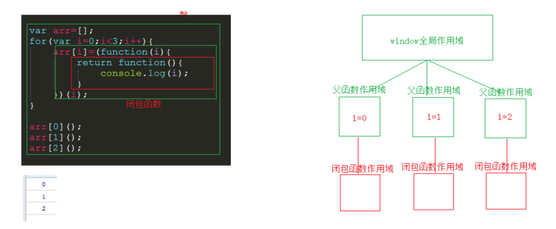
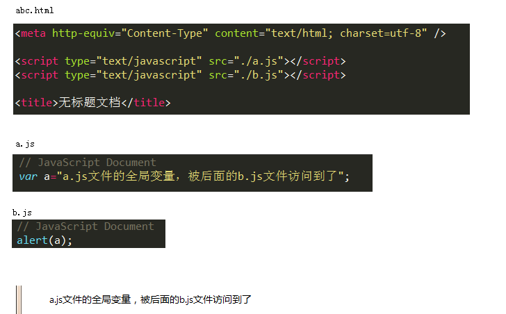
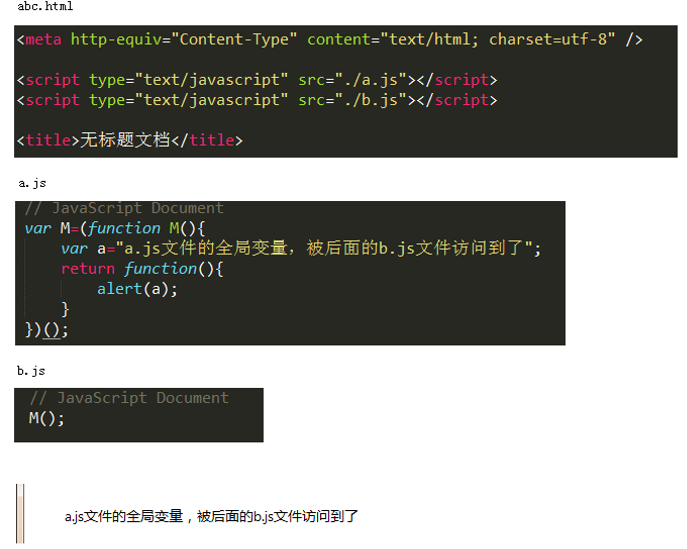
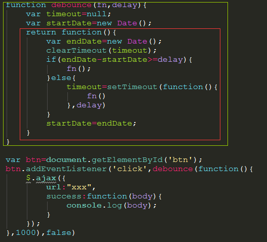
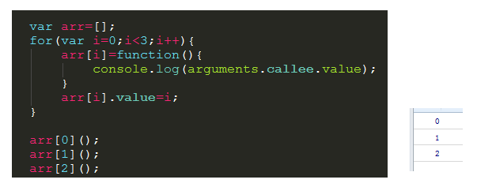

​								 															 						

# 闭包

------

### 函数作为返回值

高阶函数除了可以接受函数作为参数外，还可以把函数作为结果值返回。

我们来实现一个对`Array`的求和。通常情况下，求和的函数是这样定义的：

```
function sum(arr) {
    return arr.reduce(function (x, y) {
        return x + y;
    });
}

sum([1, 2, 3, 4, 5]); // 15
```

但是，如果不需要立刻求和，而是在后面的代码中，根据需要再计算怎么办？可以不返回求和的结果，而是返回求和的函数！

```
function lazy_sum(arr) {
    var sum = function () {
        return arr.reduce(function (x, y) {
            return x + y;
        });
    }
    return sum;
}
```

当我们调用`lazy_sum()`时，返回的并不是求和结果，而是求和函数：

```
var f = lazy_sum([1, 2, 3, 4, 5]); // function sum()
```

调用函数`f`时，才真正计算求和的结果：

```
f(); // 15
```

在这个例子中，我们在函数`lazy_sum`中又定义了函数`sum`，并且，内部函数`sum`可以引用外部函数`lazy_sum`的参数和局部变量，当`lazy_sum`返回函数`sum`时，相关参数和变量都保存在返回的函数中，这种称为“闭包（Closure）”的程序结构拥有极大的威力。

请再注意一点，当我们调用`lazy_sum()`时，每次调用都会返回一个新的函数，即使传入相同的参数：

```
var f1 = lazy_sum([1, 2, 3, 4, 5]);
var f2 = lazy_sum([1, 2, 3, 4, 5]);
f1 === f2; // false
```

`f1()`和`f2()`的调用结果互不影响。

### 闭包

注意到返回的函数在其定义内部引用了局部变量`arr`，所以，当一个函数返回了一个函数后，其内部的局部变量还被新函数引用，所以，闭包用起来简单，实现起来可不容易。

另一个需要注意的问题是，返回的函数并没有立刻执行，而是直到调用了`f()`才执行。我们来看一个例子：

```
function count() {
    var arr = [];
    for (var i=1; i<=3; i++) {
        arr.push(function () {
            return i * i;
        });
    }
    return arr;
}

var results = count();
var f1 = results[0];
var f2 = results[1];
var f3 = results[2];
```

在上面的例子中，每次循环，都创建了一个新的函数，然后，把创建的3个函数都添加到一个`Array`中返回了。

你可能认为调用`f1()`，`f2()`和`f3()`结果应该是`1`，`4`，`9`，但实际结果是：

```
f1(); // 16
f2(); // 16
f3(); // 16
```

全部都是`16`！原因就在于返回的函数引用了变量`i`，但它并非立刻执行。等到3个函数都返回时，它们所引用的变量`i`已经变成了`4`，因此最终结果为`16`。

返回闭包时牢记的一点就是：返回函数不要引用任何循环变量，或者后续会发生变化的变量。

如果一定要引用循环变量怎么办？方法是再创建一个函数，用该函数的参数绑定循环变量当前的值，无论该循环变量后续如何更改，已绑定到函数参数的值不变：

```
function count() {
    var arr = [];
    for (var i=1; i<=3; i++) {
        arr.push((function (n) {
            return function () {
                return n * n;
            }
        })(i));
    }
    return arr;
}

var results = count();
var f1 = results[0];
var f2 = results[1];
var f3 = results[2];

f1(); // 1
f2(); // 4
f3(); // 9
```

注意这里用了一个“创建一个匿名函数并立刻执行”的语法：

```
(function (x) {
    return x * x;
})(3); // 9
```

理论上讲，创建一个匿名函数并立刻执行可以这么写：

```
function (x) { return x * x } (3);
```

但是由于JavaScript语法解析的问题，会报SyntaxError错误，因此需要用括号把整个函数定义括起来：

```
(function (x) { return x * x }) (3);
```

通常，一个立即执行的匿名函数可以把函数体拆开，一般这么写：

```
(function (x) {
    return x * x;
})(3);
```

说了这么多，难道闭包就是为了返回一个函数然后延迟执行吗？

当然不是！闭包有非常强大的功能。举个栗子：

在面向对象的程序设计语言里，比如Java和C++，要在对象内部封装一个私有变量，可以用`private`修饰一个成员变量。

在没有`class`机制，只有函数的语言里，借助闭包，同样可以封装一个私有变量。我们用JavaScript创建一个计数器：

```
'use strict';

function create_counter(initial) {
    var x = initial || 0;
    return {
        inc: function () {
            x += 1;
            return x;
        }
    }
}
```

它用起来像这样：

```
var c1 = create_counter();
c1.inc(); // 1
c1.inc(); // 2
c1.inc(); // 3

var c2 = create_counter(10);
c2.inc(); // 11
c2.inc(); // 12
c2.inc(); // 13
```

在返回的对象中，实现了一个闭包，该闭包携带了局部变量`x`，并且，从外部代码根本无法访问到变量`x`。换句话说，闭包就是携带状态的函数，并且它的状态可以完全对外隐藏起来。

闭包还可以把多参数的函数变成单参数的函数。例如，要计算xy可以用`Math.pow(x, y)`函数，不过考虑到经常计算x2或x3，我们可以利用闭包创建新的函数`pow2`和`pow3`：

```
'use strict'; function make_pow(n) {    return function (x) {        return Math.pow(x, n);    } } 
```

### 脑洞大开

很久很久以前，有个叫阿隆佐·邱奇的帅哥，发现只需要用函数，就可以用计算机实现运算，而不需要`0`、`1`、`2`、`3`这些数字和`+`、`-`、`*`、`/`这些符号。

JavaScript支持函数，所以可以用JavaScript用函数来写这些计算。来试试：

```
'use strict'; // 定义数字0: var zero = function (f) {    return function (x) {        return x;    } }; // 定义数字1: var one = function (f) {    return function (x) {        return f(x);    } }; // 定义加法: function add(n, m) {    return function (f) {        return function (x) {            return m(f)(n(f)(x));        }    } } 
```


------

# 彻底理解js中的闭包

闭包是js的一个难点也是它的一个特色，是我们必须掌握的js高级特性，那么什么是闭包呢？它又有什么用呢？

我们都知道，js的作用域分两种，全局和局部，基于我们所熟悉的作用域链相关知识，我们知道在js作用域环境中访问变量的权利是由内向外的，内部作用域可以获得当前作用域下的变量并且可以获得当前包含当前作用域的外层作用域下的变量，反之则不能，也就是说在外层作用域下无法获取内层作用域下的变量，同样在不同的函数作用域中也是不能相互访问彼此变量的，那么我们想在一个函数内部也有限权访问另一个函数内部的变量该怎么办呢？闭包就是用来解决这一需求的，闭包的本质就是在一个函数内部创建另一个函数。

 

我们首先知道闭包有3个特性：

①函数嵌套函数

②函数内部可以引用函数外部的参数和变量

③参数和变量不会被垃圾回收机制回收

 

本文我们以闭包两种的主要形式来学习

 

①函数作为返回值

```
function a () {
  var name = 'dov';
  return function () {
    return name;
  }
}
var b = a();
console.log(b());
```

在这段代码中，a()中的返回值是一个匿名函数，这个函数在a()作用域内部，所以它可以获取a()作用域下变量name的值，将这个值作为返回值赋给全局作用域下的变量b,实现了在全局变量下获取到局部变量中的变量的值

再来看一个闭包的经典例子

```
function fn () {
  var num = 3;
  return function () { 
    var n = 0;
    console.log(++n);
    console.log(++num);
   }
}
var fn1 = fn();

fn1();//1 4

fn1();//1 5
```

一般情况下，在函数fn执行完后，就应该连同它里面的变量一同被销毁，但是在这个例子中，匿名函数作为fn的返回值被赋值给了fn1，这时候相当于fn1=function(){var n = 0 ... }，并且匿名函数内部引用着fn里的变量num，所以变量num无法被销毁，而变量n是每次被调用时新创建的，所以每次fn1执行完后它就把属于自己的变量连同自己一起销毁，于是乎最后就剩下孤零零的num，于是这里就产生了内存消耗的问题。

再来看一个经典例子-定时器与闭包

写一个for循环，让它按顺序打印出当前循环次数

```
for (let i = 0; i < 5; i++) {
    setTimeout(function () {
      console.log(i + "");
    }, 100);
}
```

按照预期它应该依次输出1 2 3 4 5，而结果它输出了五次5，这是为什么呢？原来由于js是单线程的，所以在执行for循环的时候定时器setTimeout被安排到任务队列中排队等待执行，而在等待过程中for循环就已经在执行，等到setTimeout可以执行的时候，for循环已经结束，i的值也已经编程5，所以打印出来五个5，那么我们为了实现预期结果应该怎么改这段代码呢？（ps:如果把for循环里面的var变成let，也能实现预期结果）

```
for (let i = 0; i < 5; i++) {
  (function (i) {
    setTimeout(function () {
      console.log(i + "");
    }, 100);
  }(i)); 
}
```

引入闭包来保存变量i，将setTimeout放入立即执行函数中，将for循环中的循环值i作为参数传递，100毫秒后同时打印出1 2 3 4 5

那如果我们想实现每隔100毫秒分别依次输出数字，又该怎么改呢?

```
for (let i = 0; i < 5; i++) {
  (function (i) {
    setTimeout(function () {
      console.log(i + "");
    }, i*100);
  }(i)); 
}
```

在这段代码中，相当于同时启动3个定时器，i*100是为4个定时器分别设置了不同的时间，同时启动，但是执行时间不同，每个定时器间隔都是100毫秒，实现了每隔100毫秒就执行一次打印的效果。

②闭包作为参数传递

```
var num = 15;
var fn1 = function (x) {
  if (x > num) {
    console.log(x)
  }
}
void function (fn2) {
  var num = 100;
  fn2(30);
}(fn1);
//30
```

在这段代码中，函数fn1作为参数传入立即执行函数中，在执行到fn2(30)的时候，30作为参数传入fn1中，这时候if(x>num)中的num取的并不是立即执行函数中的num，而是取创建函数的作用域中的num这里函数创建的作用域是全局作用域下，所以num取的是全局作用域中的值15，即30>15，打印30

最后总结一下闭包的好处与坏处

好处

①保护函数内的变量安全 ，实现封装，防止变量流入其他环境发生命名冲突

②在内存中维持一个变量，可以做缓存（但使用多了同时也是一项缺点，消耗内存）

③匿名自执行函数可以减少内存消耗

坏处

①其中一点上面已经有体现了，就是被引用的私有变量不能被销毁，增大了内存消耗，造成内存泄漏，解决方法是可以在使用完变量后手动为它赋值为null；

②其次由于闭包涉及跨域访问，所以会导致性能损失，我们可以通过把跨作用域变量存储在局部变量中，然后直接访问局部变量，来减轻对执行速度的影响


# js闭包的本质

## 为什么会有闭包

js之所以会有闭包，是因为js不同于其他规范的语言，js允许一个函数中再嵌套子函数，正是因为这种允许函数嵌套，导致js出现了所谓闭包。

简单的说，普通函数返回值，函数执行完后，函数本身就注销了。而闭包则是把函数作为一个变量返回，不会马上执行。等以后这个变量还会被调用，所以不能注销。就成了闭包。只有当被调用后，才会真正执行。

```
function a(){
    function b(){
    
    };
    b();
}
a();
```

在js正常的函数嵌套中，父函数a调用时，嵌套的子函数b的结构，在内存中产生，然后子函数又接着调用了，子函数b就注销了，此时父函数a也就执行到尾，父函数a也会把自己函数体内调用时生成的数据从内存都注销。

```
function a(){
    function b(){
    
    }
    return b;
}
var f=a();
```

这个例子中，父函数调用时，函数体内创建了子函数b，但是子函数并没有立即调用，而是返回了函数指针，以备“日后再调用”，因为“准备日后调用”，此时父函数a执行完了，就不敢注销自己的作用域中的数据了，因为一旦注销了，子函数b日后再调用时，沿着函数作用域链往上访问数据，就没有数据可以访问了，这就违背了js函数作用域链的机制。

正因此，子函数要“日后调用”，导致父函数要维持函数作用域链，而不敢注销自己的作用域，那么这个子函数就是“闭包函数”。

闭包函数在形式上有很多种。

```
function v () {
  setTimeout(() => {
    //闭包函数
  }, 0);
  document.getElementById('btn').addEventListener('click', function () {
    //闭包函数
  }, false);
  $.ajax({
    url: "xxx",
    type: "post",
    success: function () {
      //闭包函数
    }
  });
  return {
    n: function() {
      //闭包函数
    },
    m: function() {
     //闭包函数
    }
  }
}
var z = v();//函数v(),赋值给了变量z,此时并不执行。
```

在这个例子中，父函数v()体内定义了好几种子函数，这些子函数有的是异步事件的回调函数，会进入浏览器的事件循环池，等主线程工作结束后日后再调用这些回调函数，这些子函数，都导致父函数调用完了，不敢注销自己的作用域，因此这些子函数都是闭包函数。

js并不是为了创造闭包而创造，完全只是因为js允许函数嵌套，js函数嵌套还有个函数作用域链的机制，让父函数不敢注销自己作用域中的数据，才会产生所谓闭包。

也正因为这个闭包的特性，闭包函数可以让父函数的数据一直驻留在内存中保存，从而这也是后来js模块化的基础。

## 闭包与函数作用域

如果仅仅只是有函数嵌套，而没有函数作用域链，也或许不会有闭包。理解js函数作用域至关重要。

```
function a(){

}
```

函数的作用域实际上是个动态概念，上面的代码，只是定义了一个函数，并没有调用函数，函数的作用域是不存在的。只有函数a调用时，才会在内存中动态开辟一个自己的作用域，函数调用完了这个作用域又关闭了，函数运行过程中在内存创建的数据又被清除了。

```
function a(){
    var n=1;
    function b(){
        n++;
        console.log(n);
    }
    b();
    b();
    b();
}
a();
```

这个例子中，父函数a调用，首先在内存中动态开辟了作用域，然后在运算过程中，定义了函数b，子函数b()每次调用，都会开辟自己的作用域，在自己的作用域内进行运算，运算过程中访问了还处于打开状态的父函数作用域中的变量n的值，这个子函数三次调用，每次调用时候自己子作用域，访问的都是同一个变量n。但是父函数a总有执行完的时刻，总有要关闭作用域的时候。

```
var q='';
function a(){
    var n=1;
    q=function b(){
        n++;
        console.log(n);
    }
}
a();
q();
q();
q();
```

这个例子中，运行父函数，函数开启了作用域，运算过程中生成了函数b，子函数b赋给了全局变量q，导致父函数a运行完了，不敢关闭自己的作用域，,让子函数b成了闭包函数，全局变量q持有了这个闭包函数。

这个得到的结果，和上面例子中常规函数嵌套，得到的效果是一样的。但是区别在于，前一个例子中，父函数a即便执行万年，也有结束要关闭作用域的时候，而这个闭包，就让它的父函数作用域永恒了。

实际上在js的作用域机制中，有一个作用域是永恒的，就是window全局作用域，只要浏览器窗口不关闭，这个windows全局作用域就是永恒的，在全局作用域中定一个函数，无论调用几次，这几次调用都可以共享操作同一个全局变量。除了window作用域可以永恒，其他的函数作用域，总有关闭的时候而无法永恒。只有闭包函数，可以让它的父函数作用域永恒，像windows全局作用域，一直在内存中存在。

当闭包函数调用时，它会动态开辟出自己的作用域，在它之上的是父函数的永恒作用域，在父函数作用域之上的，是window永恒的全局作用域。闭包函数调用完了，它自己的作用域关闭了，从内存中消失了，但是父函数的永恒作用域和window永恒作用域还一直在内存是打开的。闭包函数再次调用时，还能访问这两个作用域，可能还保存了它上次调用时候产生的数据。只有当闭包函数的引用被释放了，它的父作用域才会最终关闭（当然父函数可能创建了多个闭包函数，就需要多个闭包函数全部释放后，父函数作用域才会关闭）。



这个例子是闭包函数的一个典型应用，示例中只有两个函数嵌套，但是加上window全局作用于，一共会有三个嵌套作用域。其中for循环了三次，三次调用了匿名自执行函数，就开了三个函数作用域，开第一个作用域时保存的i的值是0，开第二个作用域保存的是1，第三个保存的是2。三次调用父函数，又创建了三个闭包函数，每个闭包函数沿着它自己的作用域链向上访问，访问的值就都不相同。三个闭包函数调用完了，它们自己的作用域就关闭了，但是各自的父函数作用域还一直在内存中处于打开状态，下次闭包函数再调用时，再接着访问它自己的作用域。就像在window全局作用域定义了一个函数，函数调用几次，全局作用域都在，每次调用都接着访问全局作用域。

## 闭包与js模块化

日常编码中有很多地方会不经意用到了闭包只是没有察觉，使用闭包的作用就是为了两点：形成命名空间同时保存数据。



在HTML中引入多个js文件，浏览器会从第一个执行到最后一个，这些js文件都共用一个全局作用域，这很多时候就会导致命名冲突。而如果只是为了命名空间，匿名自执行函数也可以实现。

```
(function(){
    var a=1;
})()
alert(a);//访问不到变量a的值，会报错变量a未定义
```

这个例子中就借助匿名自执行函数实现了命名空间，隔离了数据，不会产生冲突，但是仅仅只是把数据封起来不提供接口有些时候或许也不行，因此这就需要闭包。



这个例子在前一个例子基础上进行了改造，a.js文件中就使用了闭包，无论这个文件引入到哪里，它的数据都是隔离的，不会会任何地方的代码产生冲突，同时它提供了闭包函数作为API接口，让其他地方以指定的方式访问数据，得到需要的结果，其他地方也不需要关心闭包结构里的数据是什么或者怎么操作的，也不需要担心引入它会与自己的代码冲突。

require.js的本质就是如此，每个模块文件就是一个大闭包。

是否使用闭包要考虑两点：隔离和数据保存。如果需要隔离数据形成命名空间，可以使用匿名自执行函数。如果需要隔离数据，同时还需要在隔离状态保存数据，保存了后面还可以继续使用，那就可以使用闭包。如果都不需要，那就使用普通函数，函数调用完作用域就关闭数据就释放了，没有保存，数据不存在了也不需要隔离了。

## 一个实际应用

淘宝的购物车中，一个商品点击新增数量或减少数量，它会往服务器发送一个请求保存新数量，但是如果快速连续点击，淘宝的购物车并没有跟随快速点击连续发送ajax，而是在连续点击的结束之后才发送了一个请求，把用户真正想要的数量最后才用一个请求发送了服务器，这样就减少了不必要的请求减少服务器的压力。

如果只是单纯用个click事件处理函数，然后把ajax放到处理函数中，点一次按钮就会发一次请求，连续点就会连续发。而要实现淘宝的这个效果，它要的原理是，定一个延时时间，比方1秒，单击之后过1秒种才发请求，而如果单击了之后还没有到1秒又连续单击了，那么重置这个计时，快速连续单击就一直再重置这个计时始终都没有达到一秒，就不会因为连续点击而发送请求，直到最后连续点击停下来了，过了一秒才发一个请求。



这个应用中就借助了闭包函数，实际click事件真正执行的用于发送请求的也就是里面嵌套的红框的闭包函数，每一次单击都会执行这个红框函数，它除了最终发送ajax，还要做个判断，如果上一次点击的时间，到这一次又点击的时间，这之间的间隔小于了指定的1秒，那么就不会发送ajax，同时重置这个计时。而在最初第一次单击的时候，它还需要上一次的时间，这个时间就只能在初始化时候用一个变量保存一个当前时间，然后第一次单击时候的时间与变量保存的时间进行一个对比。单击第二次时，那么该变量又保存了第一次单击时的时间，然后第二次单击的时间又与第一次单击的时间进行比较。

关键也就在于需要个变量保存上一次的时间。这时间不借助闭包函数也完全可以，就把这个变量放在全局环境下，在全局环境下定义一个全局变量startTime，反正就是保存一下上一次单击的时间。但是问题在于，购物车中有多个商品，并不会有只有一个单击按钮需要用到这个，多个按钮要用，给每个按钮都定义全局变量，startOne，startTwo,startThree...那就很麻烦，并且通过json渲染多个商品时候也不可能手动去定义这么多变量。这就必需借助闭包函数。

json在渲染多个商品时按钮时，这个debounce函数就会被多次调用，每一次调用都return返回了一个闭包函数给每个商品的button按钮的click作为其处理函数，那么每个处理函数都有一个专属的永恒父作用域，并且里面都已经自动定义了各自需要使用的startTime变量用于保存每个按钮自己计算时使用的上一次单击的时间。通过闭包解决这个问题这就非常方便。

## 额...



上面一个通过for()循环创建多个闭包函数，内存开多个作用域来保存不同的数据，不一定是最好的实现。这个例子中，同样是for循环创建三个了函数，但三个函数都是普通函数。由于函数在js中也是对象，因此给函数本身创建一个静态属性来保存不同的值，那么for循环创建的三个普通函数，每个函数的静态属性都保存了不同的值，而不必借助闭包结构保存不同的值，可以减少内存消耗。

