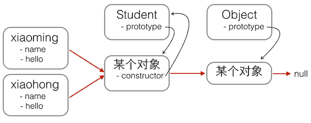

​								 															 						

# 创建对象   	

------

JavaScript对每个创建的对象都会设置一个原型，指向它的原型对象。

当我们用`obj.xxx`访问一个对象的属性时，JavaScript引擎先在当前对象上查找该属性，如果没有找到，就到其原型对象上找，如果还没有找到，就一直上溯到`Object.prototype`对象，最后，如果还没有找到，就只能返回`undefined`。

例如，创建一个`Array`对象：

```
var arr = [1, 2, 3];
```

其原型链是：

```
arr ----> Array.prototype ----> Object.prototype ----> null
```

`Array.prototype`定义了`indexOf()`、`shift()`等方法，因此你可以在所有的`Array`对象上直接调用这些方法。

当我们创建一个函数时：

```
function foo() {
    return 0;
}
```

函数也是一个对象，它的原型链是：

```
foo ----> Function.prototype ----> Object.prototype ----> null
```

由于`Function.prototype`定义了`apply()`等方法，因此，所有函数都可以调用`apply()`方法。

很容易想到，如果原型链很长，那么访问一个对象的属性就会因为花更多的时间查找而变得更慢，因此要注意不要把原型链搞得太长。

### 构造函数

除了直接用`{ ... }`创建一个对象外，JavaScript还可以用一种构造函数的方法来创建对象。它的用法是，先定义一个构造函数：

```
function Student(name) {
    this.name = name;
    this.hello = function () {
        alert('Hello, ' + this.name + '!');
    }
}
```

你会问，咦，这不是一个普通函数吗？

这确实是一个普通函数，但是在JavaScript中，可以用关键字`new`来调用这个函数，并返回一个对象：

```
var xiaoming = new Student('小明');
xiaoming.name; // '小明'
xiaoming.hello(); // Hello, 小明!
```

*注意*，如果不写`new`，这就是一个普通函数，它返回`undefined`。但是，如果写了`new`，它就变成了一个构造函数，它绑定的`this`指向新创建的对象，并默认返回`this`，也就是说，不需要在最后写`return this;`。

新创建的`xiaoming`的原型链是：

```
xiaoming ----> Student.prototype ----> Object.prototype ----> null
```

也就是说，`xiaoming`的原型指向函数`Student`的原型。如果你又创建了`xiaohong`、`xiaojun`，那么这些对象的原型与`xiaoming`是一样的：

```
xiaoming ↘
xiaohong -→ Student.prototype ----> Object.prototype ----> null
xiaojun  ↗
```

用`new Student()`创建的对象还从原型上获得了一个`constructor`属性，它指向函数`Student`本身：

```
xiaoming.constructor === Student.prototype.constructor; // true
Student.prototype.constructor === Student; // true

Object.getPrototypeOf(xiaoming) === Student.prototype; // true

xiaoming instanceof Student; // true
```

看晕了吧？用一张图来表示这些乱七八糟的关系就是：



红色箭头是原型链。注意，`Student.prototype`指向的对象就是`xiaoming`、`xiaohong`的原型对象，这个原型对象自己还有个属性`constructor`，指向`Student`函数本身。

另外，函数`Student`恰好有个属性`prototype`指向`xiaoming`、`xiaohong`的原型对象，但是`xiaoming`、`xiaohong`这些对象可没有`prototype`这个属性，不过可以用`__proto__`这个非标准用法来查看。

现在我们就认为`xiaoming`、`xiaohong`这些对象“继承”自`Student`。

不过还有一个小问题，注意观察：

```
xiaoming.name; // '小明'
xiaohong.name; // '小红'
xiaoming.hello; // function: Student.hello()
xiaohong.hello; // function: Student.hello()
xiaoming.hello === xiaohong.hello; // false
```

`xiaoming`和`xiaohong`各自的`name`不同，这是对的，否则我们无法区分谁是谁了。

`xiaoming`和`xiaohong`各自的`hello`是一个函数，但它们是两个不同的函数，虽然函数名称和代码都是相同的！

如果我们通过`new Student()`创建了很多对象，这些对象的`hello`函数实际上只需要共享同一个函数就可以了，这样可以节省很多内存。

要让创建的对象共享一个`hello`函数，根据对象的属性查找原则，我们只要把`hello`函数移动到`xiaoming`、`xiaohong`这些对象共同的原型上就可以了，也就是`Student.prototype`：


修改代码如下：

```
function Student(name) {
    this.name = name;
}

Student.prototype.hello = function () {
    alert('Hello, ' + this.name + '!');
};
```

用`new`创建基于原型的JavaScript的对象就是这么简单！

### 忘记写new怎么办

如果一个函数被定义为用于创建对象的构造函数，但是调用时忘记了写`new`怎么办？

在strict模式下，`this.name = name`将报错，因为`this`绑定为`undefined`，在非strict模式下，`this.name = name`不报错，因为`this`绑定为`window`，于是无意间创建了全局变量`name`，并且返回`undefined`，这个结果更糟糕。

所以，调用构造函数千万不要忘记写`new`。为了区分普通函数和构造函数，按照约定，构造函数首字母应当大写，而普通函数首字母应当小写，这样，一些语法检查工具如[jslint](http://www.jslint.com/)将可以帮你检测到漏写的`new`。

最后，我们还可以编写一个`createStudent()`函数，在内部封装所有的`new`操作。一个常用的编程模式像这样：

```
function Student(props) {
    this.name = props.name || '匿名'; // 默认值为'匿名'
    this.grade = props.grade || 1; // 默认值为1
}

Student.prototype.hello = function () {
    alert('Hello, ' + this.name + '!');
};

function createStudent(props) {
    return new Student(props || {})
}
```

这个`createStudent()`函数有几个巨大的优点：一是不需要`new`来调用，二是参数非常灵活，可以不传，也可以这么传：

```
var xiaoming = createStudent({
    name: '小明'
});

xiaoming.grade; // 1
```

如果创建的对象有很多属性，我们只需要传递需要的某些属性，剩下的属性可以用默认值。由于参数是一个Object，我们无需记忆参数的顺序。如果恰好从`JSON`拿到了一个对象，就可以直接创建出`xiaoming`。

### 练习

请利用构造函数定义`Cat`，并让所有的Cat对象有一个`name`属性，并共享一个方法`say()`，返回字符串`'Hello, xxx!'`：

```
'use strict';
function Cat(name) {
  this.name = name;
}
Cat.prototype.say = function () {
  return `Hello, ${this.name}!`;
}
// 测试:
var kitty = new Cat('Kitty');
var doraemon = new Cat('哆啦A梦');
if (kitty && kitty.name === 'Kitty' && kitty.say && typeof kitty.say === 'function' && kitty.say() === 'Hello, Kitty!' && kitty.say === doraemon.say) {
    console.log('测试通过!');
} else {
    console.log('测试失败!');
}
```


------

# 构造函数详解

## 一、js函数

　　首先弄明白何为函数呢，按照犀牛书的说法，函数简单的说就是重复执行的代码块。函数是这样的一段JavaScript 代码，它只定义一次，但可能被执行或调用任意次。

　　函数的定义方式：

　　　　1.声明式函数定义： 

function 函数名 （）{}；

这种定义方式，会将函数声明提升到该函数所在作用域的最开头，也是就无论你在这个函数的最小作用域的那儿使用这种方式声明的函数，在这个作用域内，你都可以调用这个函数为你所用。

　　　　2.函数表达式：

let fun = function(){}; 

此方式定义的函数，只能在该作用域中，这段赋值代码执行之后才能通过fun（）调用函数，否则，由于变量声明提升，fun === undefined。

　　　　3.new Function 形式（构造函数）： 

var fun1 = new Function (arg1 , arg2 ,arg3 ,…, argN , body )；

Function构造函数所有的参数都是字符串类型。除了最后一个参数, 其余的参数都作为生成函数的参数即形参。这里可以没有参数。最后一个参数, 表示的是要创建函数的函数体。

　　　　总结：

1 、第一种和第二种函数的定义的方式其实是第三种new Function 的语法糖，当我们定义函数时候都会通过 new Function 来创建一个函数，只是前两种为我们进行了封装，我们看不见了而已，js 中任意函数都是Function 的实例。

2、ECMAScript 定义的 函数实际上是功能完整的对象。

## 二、构造函数

　　定义：通过 new 函数名  来实例化对象的函数叫构造函数。任何的函数都可以作为构造函数存在。之所以有构造函数与普通函数之分，主要从功能上进行区别的，构造函数的主要 功能为 初始化对象，特点是和new 一起使用。new就是在创建对象，从无到有，构造函数就是在为初始化的对象添加属性和方法。

**构造函数定义时首字母大写**（规范）。

　　对new理解：new 申请内存, 创建对象,当调用new时，后台会隐式执行new Object()创建对象。所以，通过new创建的字符串、数字是引用类型，而是非值类型。

　　1、常用的构造函数： 

```
　1.  var arr = [];   为   var arr = new Array();    的语法糖。
　2.  var obj = {}   为   var obj = new Object();   的语法糖
　3.　var date = new Date();
　4.  ...
```

　　2、执行构造函数时发生的事 ：

```
function Foo(name,age,sex){
  this.name = name;
  this.age = age;
  this.sex = sex;
}
Foo.prototype.belief = function(){
  console.log('量变是质变的必要准备，质变是量变积累到一定程度的必然结果！');
}
let f = new Foo ('zh',18,'男');
```

　　　　a .  let  f = {};  //一个继承自 `Foo``.prototype` 的新对象被创建。

　　　　b.  f.__proto__ = Foo.prototype; // f 继承 Foo的原型。  

　　　　b  Foo.call(f,'zh',18,'男');  //执行Foo函数，将name,age,sex 参数传入Foo中执行，此时函数内部this 为 new 创建的 f对象，所以 f.name = 'zh';f.age = 18; f.sex = '男'；

　　　　c. 实例化对象完成，此时

```
 f = {
  name:'zh',
  age:18,
  sex:'男'
}
```

　　　　d.  f.belief();   打印'量变是质变的必要准备，质变是量变积累到一定程度的必然结果！

　　　　手写new函数　　

```
　function newTest (constructFunction){
　　　　　　let obj = {};
　　　　　　obj.__proto__ = constructFunction.prototype;
　　　　　　return function(){
　　　　　　　　constructFunction.apply(obj,arguments);
　　　　　　　　return obj;
　　　　　　}
　　　　}
```

　　　注意：当构造函数中有返回对象时候，最终new出来的对象会是构造函数的返回值，而不是new过程中生成的对象。仅当构造函数返回值是对象时有效，当不是对象时依旧返回new过程中形成的对象（无论如何new 构造函数之后都会返回一个对象值）。

## 三、ES6 中 class 与构造函数的关系

　　class 为 构造函数的语法糖，即 class 的本质是 构造函数。class的继承 extends 本质 为构造函数的原型链的继承。

　　例如：

　　**类的写法**

```
　　class Person{ //定义一个名字为Person的类
　　　　constructor(name,age){ //constructor是一个构造方法，用来接收参数
　　　　　　this.name = name; //this代表实例对象
　　　　　　this.age = age;
　　　　}　
　　　　say(){ //这是一个类的方法，注意千万不要加上function
　　　　　　return  this.name + this.age
　　　　}
　　}
　　var obj = new Person('老铁'，18);
　　console.log(obj.say());
```

　　**构造函数的写法**

　　　　function Person(name,age){  //构造函数和实例化构造名相同且大写（非强制，但这么写有助于区分构造函数和普通函数）

```
　if(!(this instanceof Person)){ //避免使用者不小心讲Person当作普通函数执行
　　　　　　　　 throw new Error(''请使用 new Person"); //仿ES6 class 中的写法
　　　　　　}
　　　　　　this.name = name;
　　　　　　this.age = age;
　　　　}
　　　　Person.prototype.say = function(){
　　　　　　return  this.name + this.age
　　　　}　　　
　　var obj = new Person('老铁'，18);  //通过构造函数创建对象，必须使用new运算符
　　console.log(obj.say());
```

　　**总结：通过class定义的类 和通过构造函数定义的类 二者本质相同。并且在js执行时，会将第一种转会为第二种执行。所以 ES6 class的写法实质就是构造函数。**

# js继承之原型继承

​	面向对象编程都会涉及到继承这个概念，JS中实现继承的方式主要是通过原型链的方法。

## 一、构造函数、原型与实例之间的关系

　　每创建一个函数，该函数就会自动带有一个 **prototype** 属性。**该属性是个指针，指向了一个对象**，我们称之为 **原型对象**。什么是指针？指针就好比学生的学号，原型对象则是那个学生。我们通过学号找到唯一的那个学生。假设突然，指针设置 null, 学号重置空了，不要慌，对象还存在，学生也没消失。只是不好找了。

　　原型对象上默认有一个属性 **constructor**，该属性也是一个指针，指向其相关联的构造函数。

　　通过调用构造函数产生的实例，都有一个**内部属性**，指向了原型对象。所以实例能够访问原型对象上的所有属性和方法。

　　

　　**所以三者的关系是，每个构造函数都有一个原型对象，原型对象都包含一个指向构造函数的指针，而实例都包含一个指向原型对象的内部指针。**通俗点说就是，实例通过内部指针可以访问到原型对象，原型对象通过constructor指针，又可以找到构造函数。

　　下面看一个例子：

```
function Dog (name) {
    this.name = name;
    this.type = 'Dog'; 
}
Dog.prototype.speak = function () {
　　alert('wang');
}
var doggie = new Dog('jiwawa');
doggie.speak();  //wang 
```

 　以上代码定义了一个构造函数 Dog(),  Dog.prototype 指向的原型对象，其自带的属性construtor又指回了 Dog，即  Dog.prototype.constructor == Dog. 实例doggie由于其内部指针指向了该原型对象，所以可以访问到 speak方法。


 

　　Dog.prototype 只是一个指针，指向的是原型对象，但是这个原型对象并不特别，它也只是一个普通对象。假设说，这时候，我们让 Dog.protptype 不再指向最初的原型对象，而是另一个类 （Animal）的实例，情况会怎样呢？

 

## 二、原型链

　　前面我们说到，所有的实例有一个内部指针，指向它的原型对象，并且可以访问原型对象上的所有属性和方法。doggie实例指向了Dog的原型对象，可以访问Dog原型对象上的所有属性和方法；如果Dog原型对象变成了某一个类的实例 aaa，这个实例又会指向一个新的原型对象 AAA，那么 doggie 此时就能访问 aaa 的实例属性和 AA A原型对象上的所有属性和方法了。同理，新的原型对象AAA碰巧又是另外一个对象的实例bbb，这个实例bbb又会指向新的原型对象 BBB，那么doggie此时就能访问 bbb 的实例属性和 BBB 原型对象上的所有属性和方法了。

　　这就是JS通过原型链实现继承的方法了。看下面一个例子：

```
//定义一个 Animal 构造函数，作为 Dog 的父类
function Animal () {
    this.superType = 'Animal';
}

Animal.prototype.superSpeak = function () {
    alert(this.superType);
}

function Dog (name) {
    this.name = name;
    this.type = 'Dog';  
}
//改变Dog的prototype指针，指向一个 Animal 实例
Dog.prototype = new Animal();
//上面那行就相当于这么写
//var animal = new Animal();
//Dog.prototype = animal;

Dog.prototype.speak = function () {
　　alert(this.type);
}
var doggie = new Dog('jiwawa');
doggie.superSpeak();  //Animal 
```

　　解释一下。以上代码，首先定义了一个 Animal 构造函数，通过new Animal()得到实例，会包含一个实例属性 superType 和一个原型属性 superSpeak。另外又定义了一个Dog构造函数。然后情况发生变化，代码中加粗那一行，将**Dog的原型对象覆盖成了 animal 实例**。当 doggie 去访问superSpeak属性时，js会先在doggie的实例属性中查找，发现找不到，然后，js就会去doggie 的原型对象上去找，doggie的原型对象已经被我们改成了一个animal实例，那就是去animal实例上去找。先找animal的实例属性，发现还是没有 superSpeack, 最后去 animal 的原型对象上去找，诶，这才找到。

（希望这张图对大家的理解有帮助吧。）　

　　

　　这就说明，我们可以通过原型链的方式，实现 Dog 继承 Animal 的所有属性和方法。

　　总结来说：就是当重写了Dog.prototype指向的原型对象后，实例的内部指针也发生了改变，指向了新的原型对象，然后就能实现类与类之间的继承了。（但是如果在重写原型对象之前，产生的实例，其内部指针指向的还是最初的原型对象。

# js继承之构造函数

原型链继承虽然很强大，但是单纯的原型链模式并不能很好地实现继承。

## 一、原型链的缺点

### **1.1 单纯的原型链继承最大的一个缺点，在于对原型中引用类型值的误修改。**

　　先看一个例子：

```
　　 //父类：人
    function Person () {
      this.head = '脑袋瓜子';
    }
    //子类：学生，继承了“人”这个类
    function Student(studentID) {
      this.studentID = studentID;
    }
    Student.prototype = new Person();

    var stu1 = new Student(1001);
    console.log(stu1.head); //脑袋瓜子

    stu1.head = '聪明的脑袋瓜子';
    console.log(stu1.head); //聪明的脑袋瓜子
    
    var stu2 = new Student(1002);
    console.log(stu2.head); //脑袋瓜子 
```

　　以上例子，我们通过重写 Student.prototype 的值为 Person 类的一个实例，实现了 Student 类对 Person 类的继承。所以 ，stu1 能访问到父类 Person 上定义的 head 属性，打印值为“脑袋瓜子”。我们知道，所有的 Student 实例都共享着原型对象上的属性。那么，如果我在 stu1 上改变了 head 属性值，是不是会影响原型对象上的 head 值呢？看我上面的代码就知道，肯定是不会。stu1 的 head 值确实是改变了，但是我重新实例化的对象 stu2 的 head 值仍旧不变。

　　这是因为，**当实例中存在和原型对象上同名的属性时，会自动屏蔽原型对象上的同名属性**。*stu1.head = "聪明的脑袋瓜子"* 实际上只是给 stu1 添加了一个本地属性 head 并设置了相关值。所以当我们打印 stu1.head 时，访问的是该实例的本地属性，而不是其原型对象上的 head 属性（它因和本地属性名同名已经被屏蔽了）。


　　刚才我们讨论的这个 head 属性是一个基本类型的值，可如果它是一个引用类型呢？这其中又会有一堆小九九。

　　其实原型对象上任何类型的值，都不会被实例所**重写/覆盖**。在实例上设置与原型对象上同名属性的值，只会在实例上创建一个同名的本地属性。

　　但是，原型对象上引用类型的值可以通过实例进行**修改**，致使所有实例共享着的该引用类型的值也会随之改变。

　　再看下面这个例子：

```
    //父类：人
    function Person () {
      this.head = '脑袋瓜子';
      this.emotion = ['喜', '怒', '哀', '乐']; //人都有喜怒哀乐
    }
    //子类：学生，继承了“人”这个类
    function Student(studentID) {
      this.studentID = studentID;
    }
    Student.prototype = new Person();

    var stu1 = new Student(1001);
    console.log(stu1.emotion); //['喜', '怒', '哀', '乐']

    stu1.emotion.push('愁');
    console.log(stu1.emotion); //["喜", "怒", "哀", "乐", "愁"]
    
    var stu2 = new Student(1002);
    console.log(stu2.emotion); //["喜", "怒", "哀", "乐", "愁"]
```

　　我们在刚才的 Person 类中又添加了一个 emotion 情绪属性，人都有喜怒哀乐嘛。尤其需要注意的是，这是一个引用类型的值。这时，stu1 认为他还很“愁”，所以就通过 stu1.emotion.push ( ) 方法在原来的基础上增加了一项情绪，嗯，打印出来“喜怒哀乐愁”，没毛病。可是 stu2 是个乐天派，他咋也跟着一起愁了呢？！肯定不对嘛～

　　这就是单纯的原型链继承的缺点，如果一个实例不小心修改了原型对象上引用类型的值，会导致其它实例也跟着受影响。

　　**因此，我们得出结论，原型上任何类型的属性值都不会通过实例被重写，但是引用类型的属性值会受到实例的影响而修改。**

### **1.2** 原型链不能实现子类向父类中传参。这里就不细说了。

## 二、借用构造函数

### 2.1 实现原理

　　在解决原型对象中包含引用类型值所带来问题的过程中，开发人员开始使用一种叫做**借用构造函数**的技术。实现原理是，在子类的构造函数中，通过 apply ( ) 或 call ( )的形式，调用父类构造函数，以实现继承。

```
    //父类：人
    function Person () {
      this.head = '脑袋瓜子';
      this.emotion = ['喜', '怒', '哀', '乐']; //人都有喜怒哀乐
    }
    //子类：学生，继承了“人”这个类
    function Student(studentID) {
      this.studentID = studentID;
      Person.call(this);
    }
    
    //Student.prototype = new Person();

    var stu1 = new Student(1001);
    console.log(stu1.emotion); //['喜', '怒', '哀', '乐']

    stu1.emotion.push('愁');
    console.log(stu1.emotion); //["喜", "怒", "哀", "乐", "愁"]
    
    var stu2 = new Student(1002);
    console.log(stu2.emotion); //["喜", "怒", "哀", "乐"]
```


　　细心的同学可能已经发现了，该例子与上面的例子非常相似，只是去掉了之前通过 prototype 继承的方法，而采用了 Person.call (this) 的形式实现继承。别忘了，函数只不过是一段可以在特定作用域执行代码的特殊对象，我们可以通过 call 方法指定函数的作用域。

　　（题外话：也许有的同学对 this 的指向还不完全清楚，我是这么理解的：谁调用它，它就指向谁。）

　　在 stu1 = new Student ( ) 构造函数时，是 stu1 调用 Student 方法，所以其内部 this 的值指向的是 stu1, 所以 Person.call ( **this** ) 就相当于Person.call ( **stu1** )，就相当于 stu1.Person( )。最后，stu1 去调用 Person 方法时，Person 内部的 this 指向就指向了 stu1。那么Person 内部this 上的所有属性和方法，都被拷贝到了 stu1 上。stu2 也是同理，所以其实是，每个实例都具有自己的 emotion 属性副本。他们互不影响。说到这里，大家应该清楚一点点了吧。

　　**总之，在子类函数中，通过call ( ) 方法调用父类函数后，子类实例 stu1, 可以访问到 Student 构造函数和 Person 构造函数里的所有属性和方法。这样就实现了子类向父类的继承，而且还解决了原型对象上对引用类型值的误修改操作。**

 

### 2.2 缺点

　　这种形式的继承，每个子类实例都会拷贝一份父类构造函数中的方法，作为实例自己的方法，比如 eat()。这样做，有几个缺点：

　　1. 每个实例都拷贝一份，占用内存大，尤其是方法过多的时候。（函数复用又无从谈起了，本来我们用 prototype 就是解决复用问题的）

　　2. 方法都作为了实例自己的方法，当需求改变，要改动其中的一个方法时，之前所有的实例，他们的该方法都不能及时作出更新。只有后面的实例才能访问到新方法。

```
    //父类：人
    function Person () {
      this.head = '脑袋瓜子';
      this.emotion = ['喜', '怒', '哀', '乐']; //人都有喜怒哀乐
      this.eat = function () {
        console.log('吃吃喝喝');
      }
      this.sleep = function () {
        console.log('睡觉');
      }
      this.run = function () {
        console.log('快跑');
      }
    } 
```

　　所以，**无论是单独使用原型链继承还是借用构造函数继承都有自己很大的缺点，最好的办法是，将两者结合一起使用，发挥各自的优势**。

# js继承之组合继承

在我的前两篇文章中，我们已经介绍了 js 中实现继承的两种模式：原型链继承和借用构造函数继承。这两种模式都存在各自的缺点，所以，我们考虑是否能将这二者结合到一起，从而发挥二者之长。即在继承过程中，既可以保证每个实例都有它自己的属性，又能做到对一些属性和方法的复用。这样就 perfect 了。

## 一、回顾借用构造函数继承的缺点

先看我们之前在借用构造函数继承中最后用到的代码：

```
    //父类：人
    function Person () {
      this.head = '脑袋瓜子';
      this.emotion = ['喜', '怒', '哀', '乐']; //人都有喜怒哀乐
      this.eat = function () {
        console.log('吃吃喝喝');
      }
      this.sleep = function () {
        console.log('睡觉');
      }
      this.run = function () {
        console.log('快跑');
      }
    }
    //子类：学生，继承了“人”这个类
    function Student(studentID) {
      this.studentID = studentID;
      Person.call(this);
    }
    
    //Student.prototype = new Person();

    var stu1 = new Student(1001);
    console.log(stu1.emotion); //['喜', '怒', '哀', '乐']

    stu1.emotion.push('愁');
    console.log(stu1.emotion); //["喜", "怒", "哀", "乐", "愁"]
    
    var stu2 = new Student(1002);
    console.log(stu2.emotion); //["喜", "怒", "哀", "乐"]
```

　　在这段代码中，我们通过借用构造函数继承，保证了 stu1 和 stu2 都有各自的父类属性副本，从而使得各自 emotion 互不影响。但同时带来的问题是，stu1 和 stu2 都拷贝了 Person 类中的所有属性和方法，而在 Person 类中，像 eat ( ), sleep ( ), run ( ) 这类方法应该是公用的，而不需要添加到每个实例上去，增大内存，尤其是这类方法较多的时候。

 

## 二、结合使用两种继承模式

　　所以我们想到，是否能把这些方法挂载到父类的原型对象上去，实现方法复用，然后子类通过原型链继承，就能调用这些方法啦？～

```
    //父类：人
    function Person () {
      this.head = '脑袋瓜子';
      this.emotion = ['喜', '怒', '哀', '乐']; //人都有喜怒哀乐
    }
    //将 Person 类中需共享的方法放到 prototype 中，实现复用
    Person.prototype.eat = function () {
      console.log('吃吃喝喝');
    }
    Person.prototype.sleep = function () {
      console.log('睡觉');
    }
    Person.prototype.run = function () {
      console.log('快跑');
    }
    //子类：学生，继承了“人”这个类
    function Student(studentID) {
      this.studentID = studentID;
      Person.call(this);
    }
    
    Student.prototype = new Person();  //此时 Student.prototype 中的 constructor 被重写了，会导致 stu1.constructor === Person
    Student.prototype.constructor = Student;  //将 Student 原型对象的 constructor 指针重新指向 Student 本身

    var stu1 = new Student(1001);
    console.log(stu1.emotion); //['喜', '怒', '哀', '乐']

    stu1.emotion.push('愁');
    console.log(stu1.emotion); //["喜", "怒", "哀", "乐", "愁"]
    
    var stu2 = new Student(1002);
    console.log(stu2.emotion); //["喜", "怒", "哀", "乐"]

    stu1.eat(); //吃吃喝喝
    stu2.run(); //快跑
    console.log(stu1.constructor);  //Student
```


　　首先，我们将 Person 类中需要复用的方法提取到 Person.prototype 中，然后设置 Student 的原型对象为 Person 类的一个实例，这样 stu1 就能访问到 Person 原型对象上的属性和方法了。其次，为保证 stu1 和 stu2 拥有各自的父类属性副本，我们在 Student 构造函数中，还是使用了 Person.call ( this ) 方法。如此，结合原型链继承和借用构造函数继承，就完美地解决了之前这二者各自表现出来的缺点。